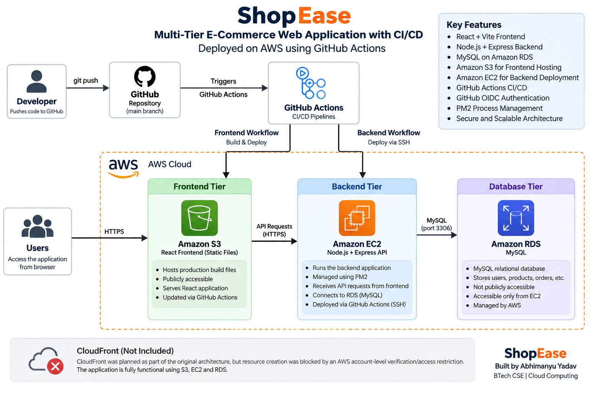
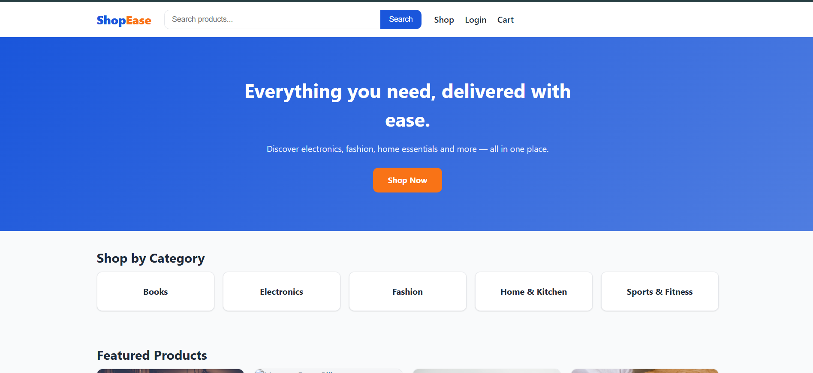
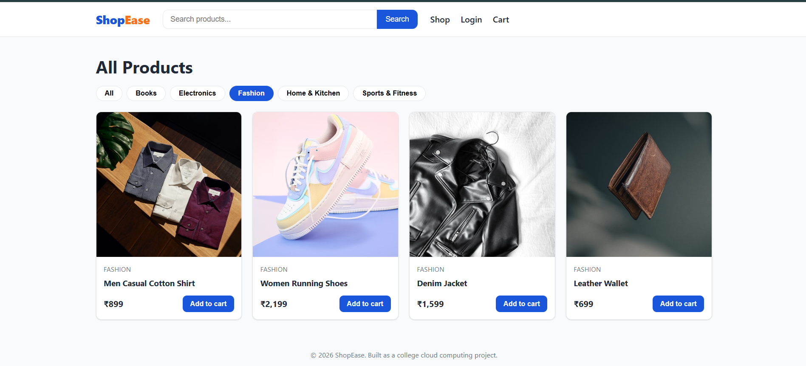
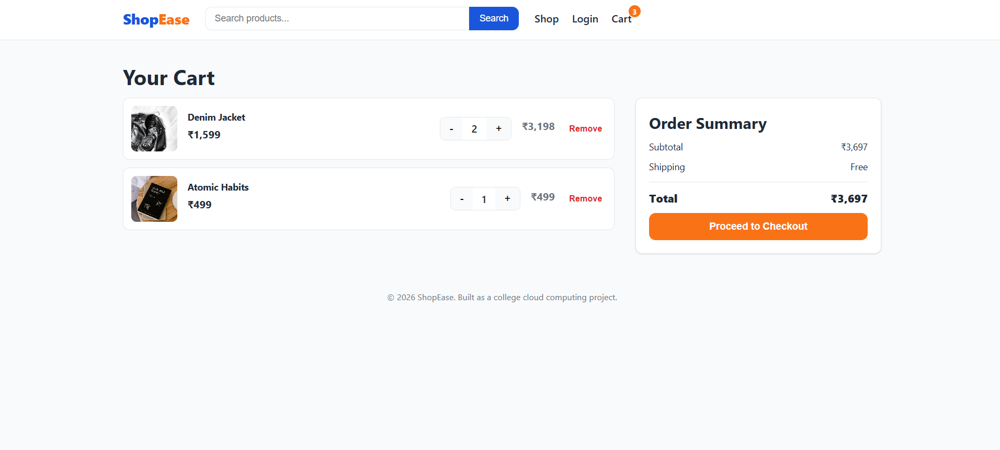
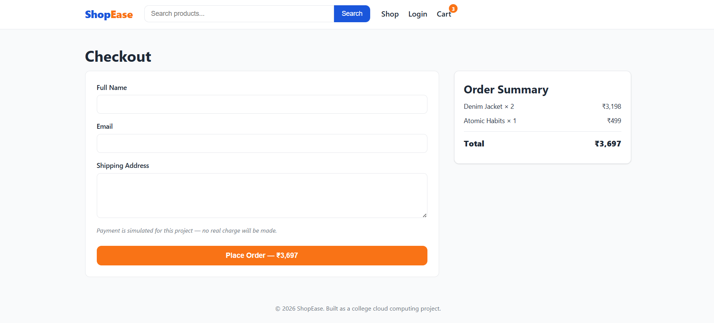

# 🛒 ShopEase — Multi-Tier E-Commerce Web Application with CI/CD

ShopEase is a full-stack e-commerce web application deployed using a multi-tier cloud architecture on AWS.

The project demonstrates how a frontend, backend API, and relational database can be separated into independent application tiers and connected through automated CI/CD pipelines using GitHub Actions.

---

## 🚀 Project Overview

ShopEase consists of three main application tiers:

- **Frontend:** React + Vite
- **Backend:** Node.js + Express REST API
- **Database:** MySQL on Amazon RDS

### ☁️ AWS Deployment

- **Amazon S3** — Frontend deployment
- **Amazon EC2** — Backend application
- **Amazon RDS** — MySQL database
- **AWS IAM** — Identity and access management
- **GitHub Actions** — CI/CD automation
- **GitHub OIDC** — Secure AWS authentication
- **PM2** — Node.js process management
- **AWS Security Groups** — Network access control

The application was tested end-to-end with the React frontend communicating with the backend running on EC2 and the database hosted on Amazon RDS.

---

## ✨ Features

### 🎨 Frontend

- Responsive e-commerce interface
- Product browsing
- Product search
- Category filtering
- Product details
- Shopping cart
- Cart quantity management
- Checkout flow
- Order confirmation
- User registration and login
- JWT-based authentication
- Loading and error states

### ⚙️ Backend

- RESTful API built with Node.js and Express
- Product and category APIs
- Shopping cart APIs
- User authentication
- JWT authentication
- Password hashing using bcrypt
- Input validation
- Transaction-based order processing
- Stock quantity management
- Configurable CORS
- Centralized error handling

### 🗄️ Database

- MySQL relational database
- Users
- Products
- Categories
- Cart
- Orders
- Order items
- Relational database relationships
- Seed data with sample products

---

## 🏗️ AWS Architecture

The application follows a multi-tier architecture with separate frontend, backend, and database tiers.



### Frontend Tier

The React/Vite application is built into production-ready static files and deployed to an Amazon S3 bucket using GitHub Actions.

### Backend Tier

The Node.js/Express REST API runs on an Amazon EC2 instance.

PM2 is used to manage the Node.js application process and keep the backend running.

### Database Tier

The application uses Amazon RDS running MySQL.

The RDS database is not publicly accessible. Database access is restricted to the backend EC2 instance through AWS Security Groups.

---

## 🔄 CI/CD Pipeline

GitHub Actions automates deployment whenever relevant code changes are pushed to the `main` branch.

### 🎨 Frontend CI/CD

```text
Developer
    │
    ▼
GitHub Repository
    │
    ▼
GitHub Actions
    │
    ├── Checkout repository
    ├── Install dependencies
    ├── Build React application
    ├── Authenticate with AWS using OIDC
    └── Deploy production build
            │
            ▼
        Amazon S3
```

The frontend workflow:

1. Checks out the repository
2. Installs frontend dependencies
3. Builds the React application
4. Authenticates with AWS using GitHub OIDC
5. Deploys the production build to Amazon S3

### ⚙️ Backend CI/CD

```text
Developer
    │
    ▼
GitHub Repository
    │
    ▼
GitHub Actions
    │
    ├── Checkout repository
    ├── Connect to EC2 using SSH
    ├── Pull latest code
    ├── Install production dependencies
    └── Restart application using PM2
            │
            ▼
        Amazon EC2
```

The backend workflow:

1. Checks out the repository
2. Establishes an SSH connection to EC2
3. Pulls the latest code from GitHub
4. Installs production dependencies
5. Restarts the Node.js application using PM2

---

## 🔐 Security

The project implements several security practices:

- Environment variables for application configuration
- Secrets excluded from Git using `.gitignore`
- GitHub OIDC for temporary AWS credentials
- No permanent AWS access keys stored in GitHub
- SSH authentication for backend deployment
- Separate EC2 and RDS Security Groups
- RDS database is not publicly accessible
- Database access restricted to the backend server
- Configurable CORS
- Sensitive credentials are never committed to the repository

Sensitive values such as database passwords, JWT secrets, private SSH keys, and AWS credentials are stored outside the source code.

---

## 🛠️ Technology Stack

### Frontend

- React 18
- Vite
- React Router
- JavaScript
- CSS

### Backend

- Node.js
- Express.js
- REST API
- JWT
- bcrypt
- express-validator
- CORS

### Database

- MySQL 8
- Amazon RDS

### Cloud & DevOps

- Amazon EC2
- Amazon S3
- Amazon RDS
- AWS IAM
- AWS Security Groups
- GitHub Actions
- GitHub OIDC
- PM2

### Development Tools

- Git
- GitHub
- VS Code
- npm

---

## 📁 Project Structure

```text
multi-tier-ecommerce-cicd/
│
├── frontend/
│   ├── src/
│   ├── public/
│   ├── package.json
│   └── vite.config.js
│
├── backend/
│   ├── src/
│   │   ├── controllers/
│   │   ├── middleware/
│   │   ├── routes/
│   │   ├── config/
│   │   └── server.js
│   ├── package.json
│   └── .env.example
│
├── database/
│   ├── schema.sql
│   └── seed.sql
│
├── screenshots/
│   ├── homepage.png
│   ├── categories.png
│   ├── user login.png
│   ├── cart.png
│   ├── checkout.png
│   └── github actions.png
│
├── architecture/
│   └── architecture-diagram.png
│
├── .github/
│   └── workflows/
│       ├── deploy-frontend.yml
│       └── deploy-backend.yml
│
├── .gitignore
├── .env.example
├── LEARNINGS.md
└── README.md
```

---

## ⚙️ Local Setup

### 1. Clone the Repository

```bash
git clone https://github.com/git-hubbie666/multi-tier-ecommerce-cicd.git
cd multi-tier-ecommerce-cicd
```

### 2. Backend Setup

```bash
cd backend
npm install
```

Create a `.env` file:

```env
PORT=5000
DB_HOST=localhost
DB_PORT=3306
DB_NAME=shopease
DB_USER=root
DB_PASSWORD=your_password
JWT_SECRET=your_secret
CORS_ORIGIN=http://localhost:5173
```

Start the backend:

```bash
npm run dev
```

The API will run on:

```text
http://localhost:5000
```

### 3. Database Setup

Create the MySQL database:

```sql
CREATE DATABASE shopease;
```

Import the database schema and seed data from the `database/` directory.

### 4. Frontend Setup

Open another terminal:

```bash
cd frontend
npm install
npm run dev
```

The frontend will run on the local Vite development server.

---

## 🔌 API Overview

| Method | Endpoint | Description |
|---|---|---|
| GET | `/api/products` | Get products |
| GET | `/api/categories` | Get categories |
| GET | `/api/products/:id` | Get product details |
| POST | `/api/auth/register` | Register user |
| POST | `/api/auth/login` | Login user |
| GET | `/api/cart` | Get cart |
| POST | `/api/cart` | Add item to cart |
| PUT | `/api/cart/:id` | Update cart item |
| DELETE | `/api/cart/:id` | Remove cart item |
| POST | `/api/orders` | Create order |

---

## ☁️ AWS Resources

| AWS Resource | Purpose |
|---|---|
| Amazon S3 | Host and deploy frontend build |
| Amazon EC2 | Run Node.js/Express backend |
| Amazon RDS | Host MySQL database |
| AWS IAM | Manage permissions and OIDC authentication |
| Security Groups | Control network access |
| GitHub Actions | Automate CI/CD |
| PM2 | Manage Node.js backend process |

---

## 📊 Deployment Flow

```text
                         GitHub Repository
                                │
                  ┌─────────────┴─────────────┐
                  │                           │
                  ▼                           ▼
          Frontend Workflow            Backend Workflow
          GitHub Actions               GitHub Actions
                  │                           │
                  ▼                           ▼
             Amazon S3                  Amazon EC2
          React Frontend             Node.js + Express
                                              │
                                              ▼
                                         Amazon RDS
                                         MySQL Database
```

---

## 📸 Screenshots

### 🏠 Homepage



### 📂 Product Categories



### 👤 User Login


### 🛒 Shopping Cart



### 💳 Checkout



### ⚙️ GitHub Actions CI/CD


---

## 🧠 Key Learnings

Through this project, the following concepts were implemented:

- Multi-tier application architecture
- React frontend deployment
- REST API development
- MySQL database integration
- Amazon EC2 deployment
- Amazon RDS deployment
- Amazon S3 deployment
- Linux server management
- PM2 process management
- Git and GitHub
- GitHub Actions
- CI/CD pipelines
- GitHub OIDC authentication
- AWS IAM
- AWS Security Groups
- Environment-based configuration
- CORS configuration
- Cloud deployment troubleshooting

---

## ⚠️ CloudFront

CloudFront was planned as part of the original frontend architecture.

However, CloudFront resource creation was blocked by an AWS account-level access restriction even though customer verification had been completed.

Therefore, CloudFront was not included in the final deployed environment.

The implemented application successfully uses Amazon S3, EC2, and RDS with automated CI/CD deployment.

---

## 🎯 Project Objective

This project was developed as part of a Cloud Computing internship to demonstrate practical knowledge of:

- Cloud infrastructure
- Multi-tier architecture
- AWS services
- Application deployment
- CI/CD automation
- Database integration
- Cloud security fundamentals
- DevOps practices

---

## 👨‍💻 Author

**Abhimanyu Yadav**

BTech Computer Science & Engineering  
Cloud Computing

---

⭐ If you found this project useful, feel free to explore the repository and its implementation.